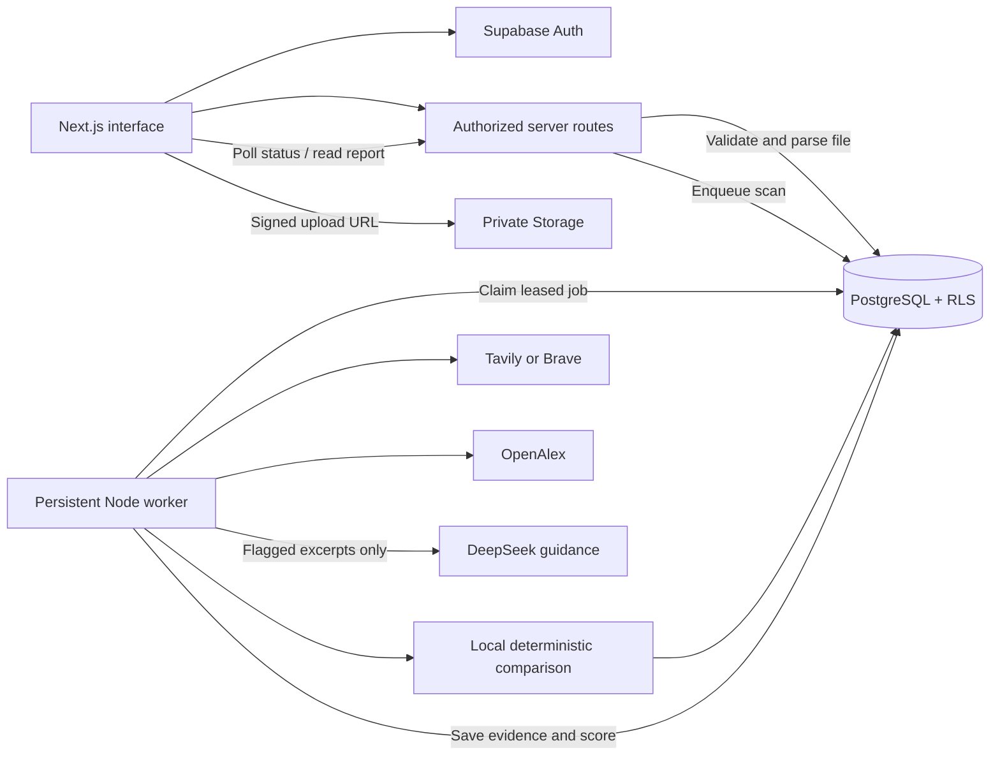

# ThesisGuard architecture

**Design of an Online Student Thesis Repository with Automated Plagiarism Detection and Prevention**

## Three tiers

1. **Presentation:** Next.js App Router Server Components load authorized data; small Client Components handle forms, navigation drawers, upload progress, scan polling, and report filters. Tailwind controls responsive layout, while a single Material UI theme supplies accessible controls. The MUI App Router cache provider collects server-rendered styles. Public pages work without secrets; private pages show a configuration state when Supabase is absent.
2. **Application:** `src/lib/services` contains data access workflows, upload admission, thesis creation, and scan orchestration. `auth` verifies Supabase identity with `getUser`, then reads the database role. `documents`, `plagiarism`, `search`, `security`, `ai`, and `reports` implement reusable business operations. Route handlers validate requests and delegate to these services. `src/components/pages/` composes the role-specific server-rendered screens.
3. **Data:** Supabase Auth owns passwords and sessions. PostgreSQL holds academic metadata, document indexes, scan jobs, evidence, reviews, settings, and roles. A private Supabase Storage bucket holds document binaries. No permanent public document URLs are created.

## Main flows

### Upload

The browser requests a signed staging upload URL. The file goes directly to Supabase Storage so a 20 MB document does not travel through a hosting function request body. Finalization sends only metadata and the path to the application. The server verifies path ownership, downloads the private file, validates the signature and size, extracts text, and creates the thesis and fingerprint chunks. It writes the validated document under a new immutable path and removes the staging object. The multipart endpoint also supports self-hosted clients.

Failed, abandoned browser uploads can leave staging objects. The maintenance script deletes staging objects older than 24 hours. Never serve a staging object to users. Finalization may transfer the file twice within server-side storage operations; this is a correctness-first implementation with a documented bandwidth tradeoff.

### Scan queue and recovery

`enqueue_scan` serializes admission per requester using a PostgreSQL advisory transaction lock. A partial unique index prohibits two active scans on the same thesis. Daily admission uses UTC day boundaries. `claim_scan` uses `FOR UPDATE SKIP LOCKED`, enabling multiple worker processes without normally claiming the same job. The worker renews a heartbeat every 15 seconds. A three-minute stale lease can be reclaimed; three interrupted attempts become a failure. Partial source rows are cleared on restart, cascading their match rows.

Run the worker separately from the Next.js request process. It is not a browser timer, an unawaited request promise, or an in-memory-only job queue. Stop it gracefully with SIGINT/SIGTERM. A worker can run on the same development machine without another paid service.

### Failure boundaries

Repository failure fails the scan because it is the institution's core evidence source. Web and OpenAlex failures add warnings and allow other checks to continue. DeepSeek failure preserves the deterministic score and saved source evidence. A completed report supports retrying guidance alone without searching again. Disabled providers and incomplete source retrieval remain visible in reports.

### Security boundaries

- Roles are read from `profiles`, never user-editable Auth metadata. The registration trigger always creates STUDENT.
- Application mutations use a server-only service-role client **after** identity, role, and ownership checks. Direct Data API workflow writes are revoked. Limited profile field updates have column grants and RLS.
- SQL helper functions that need privileged access live in `private`, use fixed search paths, and derive access from `auth.uid()`. Service RPCs are not executable by public users.
- RLS protects thesis, source, match, and scan reads even if a UI element is manipulated.
- Download URLs expire after 60 seconds. Browser content is escaped by React. External links allow HTTP/S only.
- Source retrieval resolves and checks addresses, pins the resolved IP for the connection, validates every redirect, and limits content type, bytes, and time. Authentication walls and paywalls are not bypassed.
- Search providers and AI see selected passages. The scan screen discloses this before a user starts analysis.

## Deployment shape and limits

The UI/API may run on Vercel; the persistent worker must run on a machine that supports long-running Node processes. Vercel alone is not a worker deployment. Supabase is the shared data tier. Free-tier API quotas are finite; local comparison needs no paid AI call. Before production, configure SMTP, backup/retention policies, monitoring, abuse controls, and institution consent/retention policies.
